#EX.NO:1
Data Cleaning Process

# AIM
To read the given data and perform data cleaning and save the cleaned data to a file.

# Explanation
Data cleaning is the process of preparing data for analysis by removing or modifying data that is incorrect ,incompleted , irrelevant , duplicated or improperly formatted. Data cleaning is not simply about erasing data ,but rather finding a way to maximize datasets accuracy without necessarily deleting the information.

# Algorithm
STEP 1: Read the given Data

STEP 2: Get the information about the data

STEP 3: Remove the null values from the data

STEP 4: Save the Clean data to the file

STEP 5: Remove outliers using IQR

STEP 6: Use zscore of to remove outliers

# Coding and Output
          
        ```
        import numpy as np
import pandas as pd
data=pd.read_csv("SAMPLEIDS.csv")
data

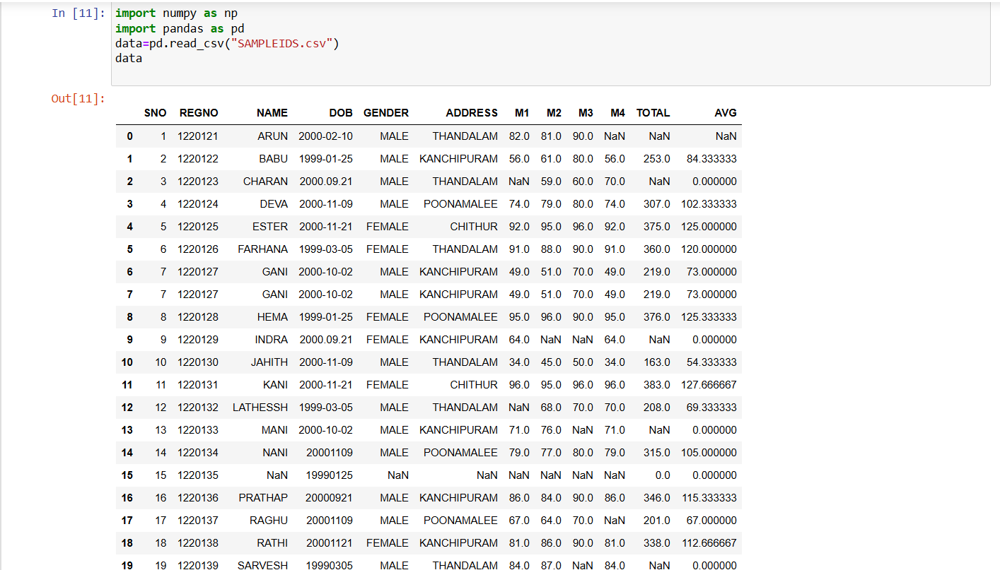

data.head(4)

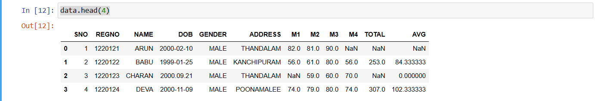

 data.tail(7)


 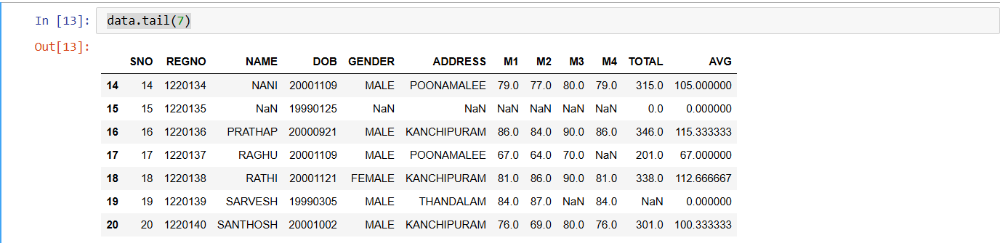

data.isnull()

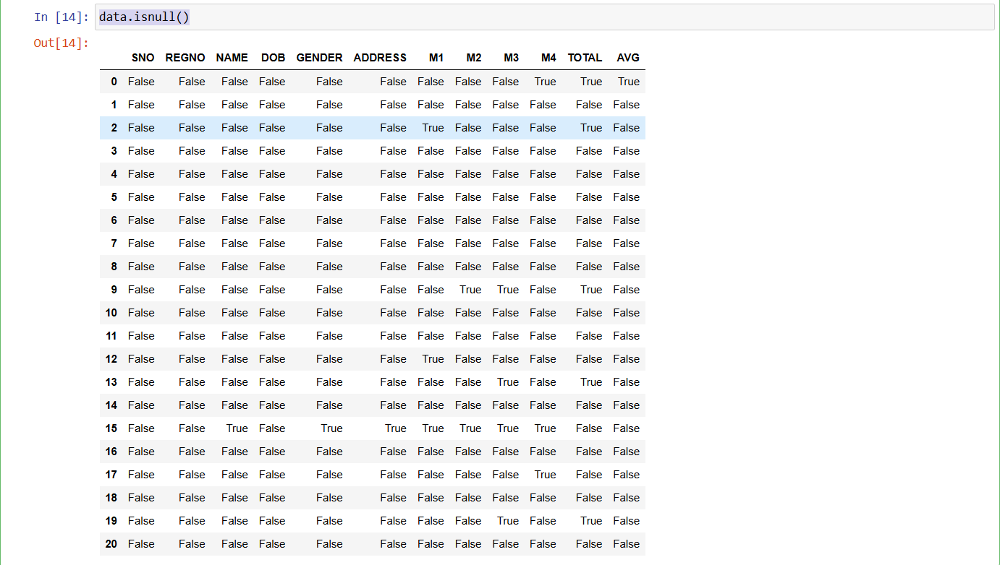

 data.notnull()


 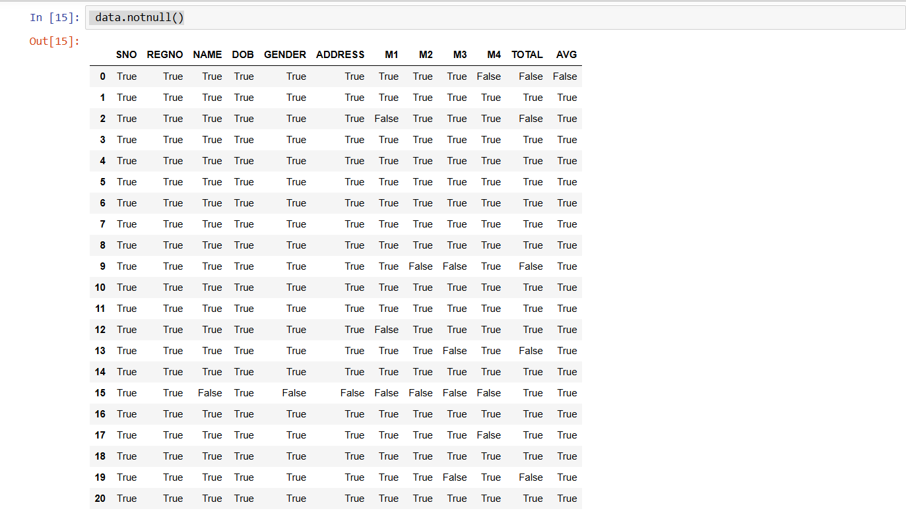

data.isnull().sum()


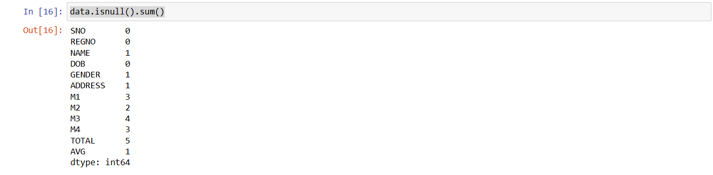

data.isnull().any()


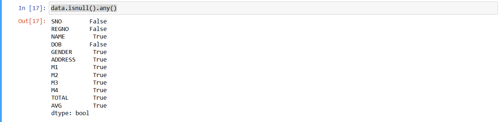

data.dropna(axis=1)


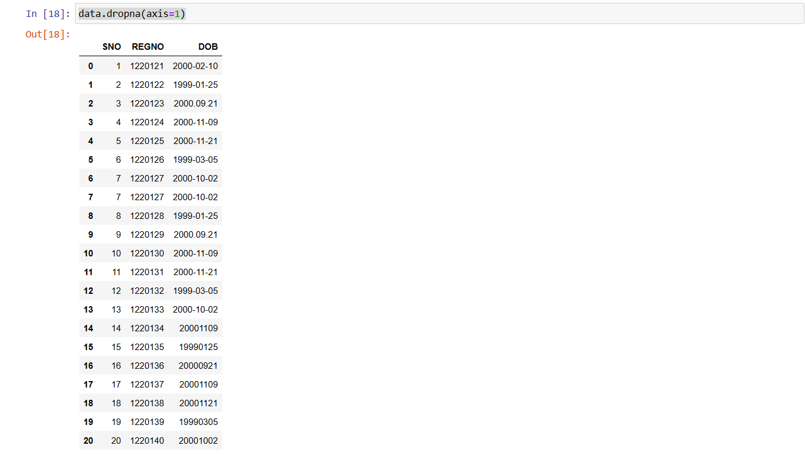

data.dropna(axis=0)

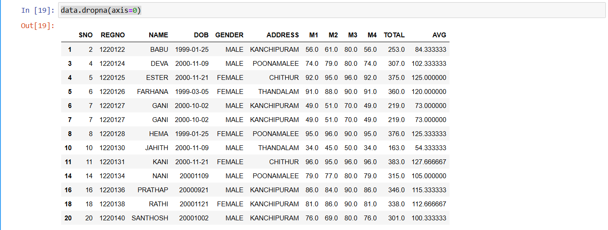


data.fillna(0)


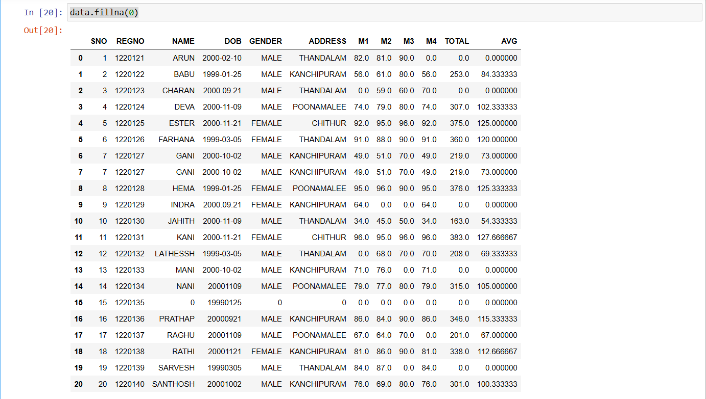


data.bfill()


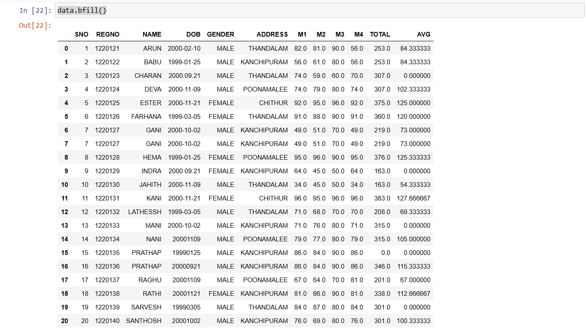


data.fillna({'REGNO':0, 'NAME':'PRAVEEN'})

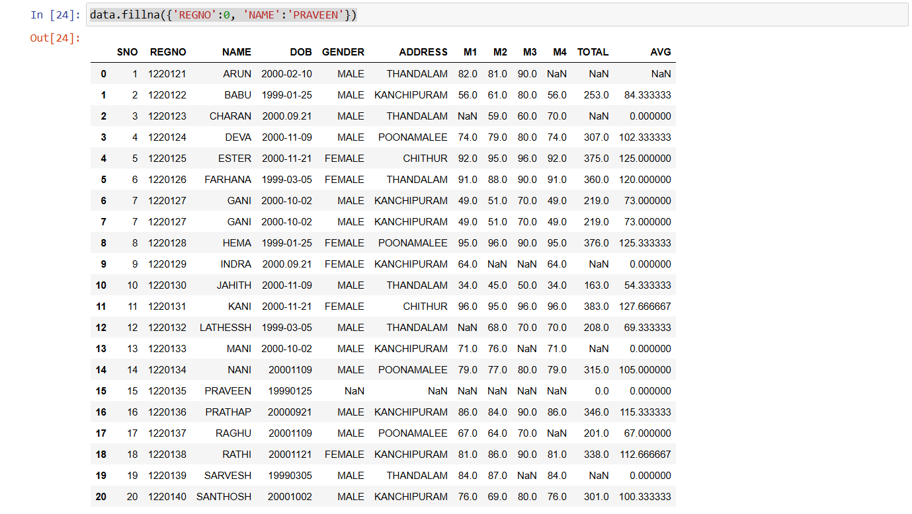


ir=pd.read_csv("iris.csv")
ir

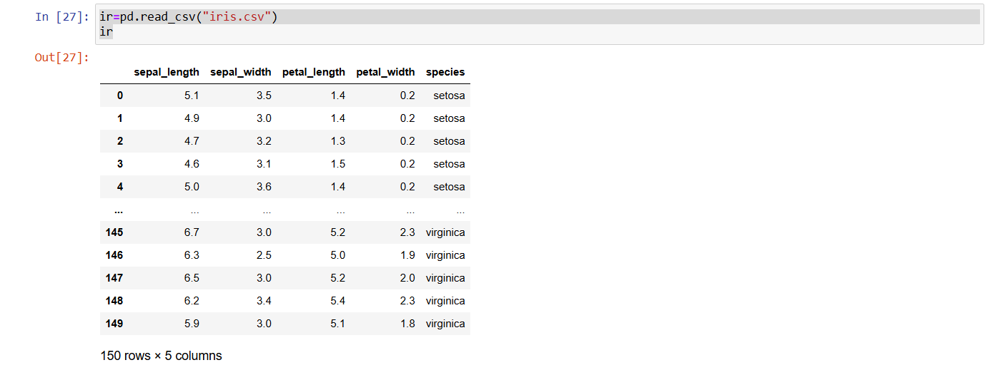

ir.describe()


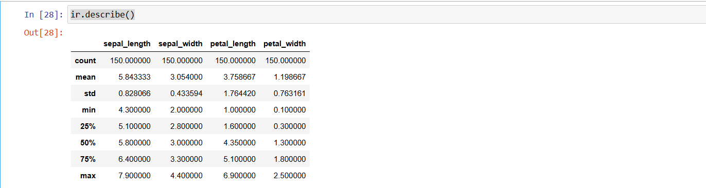


import seaborn as sns
sns.boxplot(x="sepal_width",data=ir)


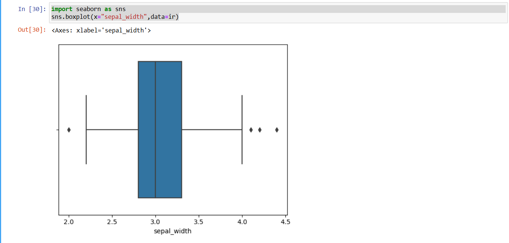


q1=ir.sepal_width.quantile(0.25)
q3=ir.sepal_width.quantile(0.75)
iqr=q3-q1
print(iqr)

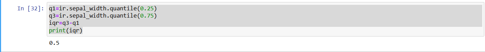


rid=ir[((ir.sepal_width<(q1-1.5*iqr))|(ir.sepal_width>(q3+1.5*iqr)))]
rid['sepal_width']

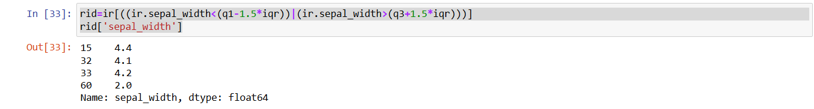


rid=ir[~((ir.sepal_width<(q1-1.5*iqr))|(ir.sepal_width>(q3+1.5*iqr)))]
rid

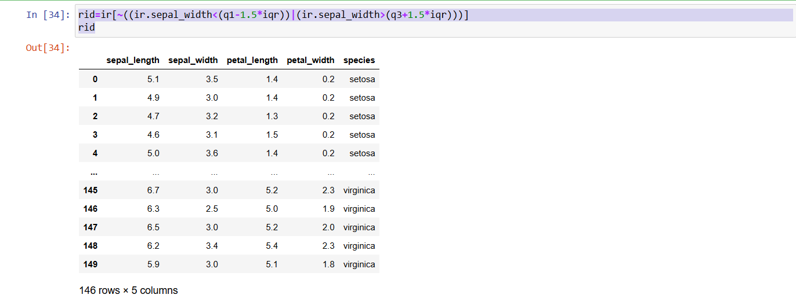


import numpy as np
import scipy.stats as stats
z=np.abs(stats.zscore(ir.sepal_width))
z

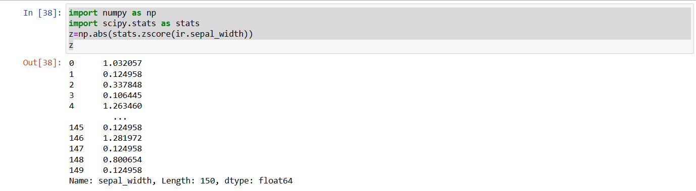


# Result
          
Thus the programs are executed successfully